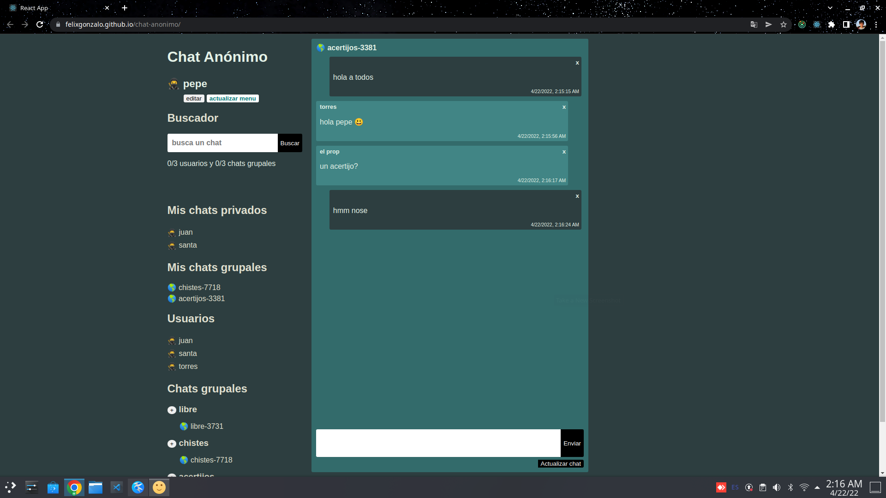

# Mi resultado v1 del Reto chat anónimo

[Link a versión 1](https://felixgonzalo.github.io/chat-anonimo/)

## Realizado

- Todos los requerimientos cumplidos.
- Stack requerido

## Plan para v2

- Mejorar la utilización de localStorage
- Mejorar el manejo de tipos de datos
- Mejorar el diseño

# Reto chat anónimo

Se desea construir un chat donde cada usuario sea uno nuevo por cada pestaña y pueda escribir a otros usuarios en privado o escribir en chats grupales por categoría, donde las categorías ya son dadas desde un comienzo a libre elección del participante.

## Requerimientos

1. Chats grupales por categorias.
2. Chats privados de usuarios a usuario.
3. Lista de todos los usuarios existentes.
4. Lista de mis chats existentes.
5. Poder cambiar el nick anónimo que se me asigna al entrar.
6. Buscador de usuarios o grupos.
7. Cada usuario debe poder crear chats grupales.

## Vista de cada chat

1. Poder mandar mensajes.
2. Poder borrar mensajes (Se le debe ocultar solo al que borro el mensaje).

## Getting Started with Create React App

This project was bootstrapped with [Create React App](https://github.com/facebook/create-react-app).

## Stack Requeridos

- React
- Styled components
- React hooks
- Componentes funcionales
- Redux
- Typescript

No es necesario hacer el backend, se puede hacer solo en el navegador
